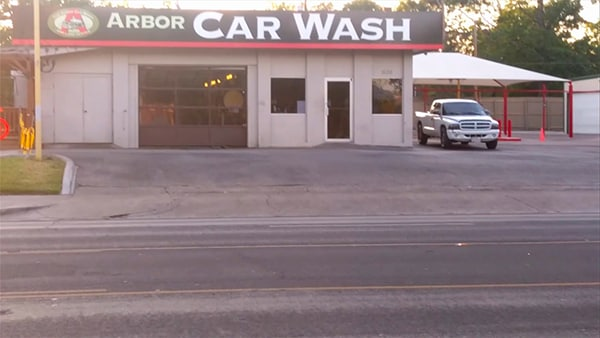
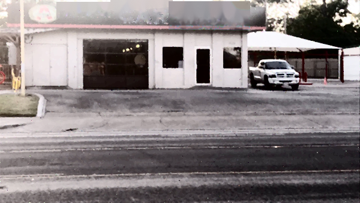
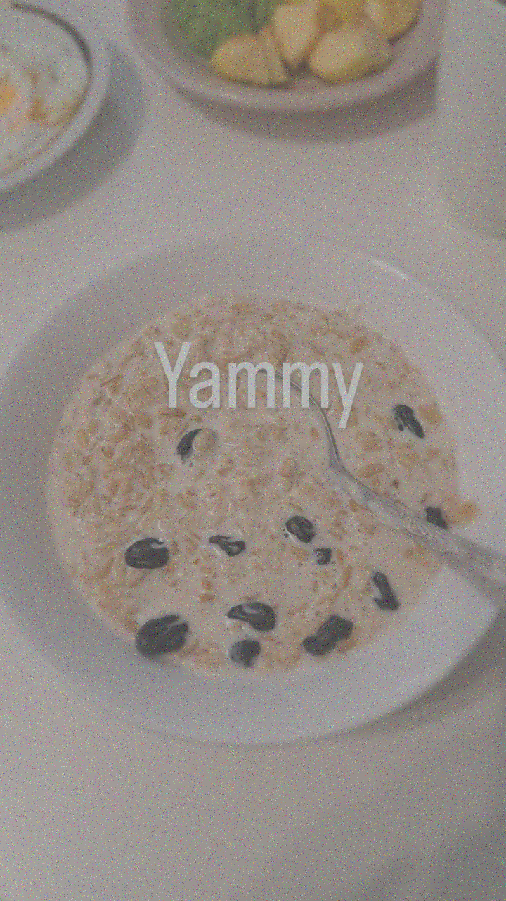
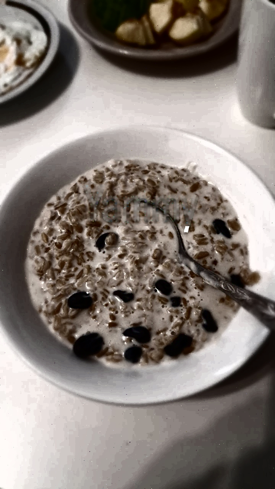

## About
The program removes the text from the image using an technique called inpainting.

## Procedures
`Noise reduction.` Before applying text recognition algorithms, the image has to be pre-processed from different types of noises and disturbances and adjust the contrast. First, the removal of the noise, in particular salt-and-pepper noise, is an important step as it facilitates and increases the accuracy of the text detection algorithm. Salt and pepper noise refers to a wide variety of processes that result in the same basic image degradation: only a few pixels are noisy, but they are very noisy. The effect is similar to sprinkling white and black dots - akin to salt and pepper - on the image. To do so, there exist two methods - median filter and morphological filter. Since the scope of our course covers the first, we decided to implement the median filter. Furthermore, the program applies `histogram equalization` on the image to increase the contrast between objects, thereby making the text, in particular, stand out.

Next, step is `localizing text`. To do so, Google Cloud Vision is utilized. Using API methods, it returns the bounding boxes for texts in the input image. 

Now that we have the bounding boxes for the text, we should come up with an algorithm that replaces those pixels in the bounding box so that it to produces a non-text restored background image. To do that, we have looked up to several methods form the related work and decided to resort to the one that is presented by [Wagh and Patil](https://ieeexplore.ieee.org/document/7087154/) [1]. The method was encompasses three procedures: text localization, text extraction, and text removal using inpainting. 

We now focus on the last procedure - `inpainting`. In this stage, the bounding boxes are filled with appropriate colors present using nearest-matching neighborhood inpainting. To generate visually plausible region filling results, smoothing is carried out on the selected filled patches.
According to the paper, "border of damaged region is searched and the pixel with smallest number of damage pixels in its 8-neighbors is used, with window centered on that selected pixel. In this step, The best matching pixel having more similarity to damaged one is searched using sum squared difference (SSD) criterion. Inpainting of selected pixel takes place from the color of best match pixel. But in case of high intensity change for order pixel is carried out using high intensity variation".

## IEEE format paper of the project
The paper with extended description and examples can be found at this [link](https://github.com/aidarjpg/text-remover-from-image/blob/main/ROBT310_paper.pdf).

## Results
<table>
  <tr>
    <td align="center">
      <a href="#">
         
        
          <b>Before</b>
        
      </a>
    </td>
    <td align="center">
      <a href="#">
         
        
          <b>After</b>
        
      </a>
    </td>
  </tr>
</table>

<table>
  <tr>
    <td align="center">
      <a href="#">
         
        
          <b>Before</b>
        
      </a>
    </td>
    <td align="center">
      <a href="#">
         
        
          <b>After</b>
        
      </a>
    </td>
  </tr>
</table>

## References
1. P. D. Wagh and D. R. Patil, ”Text detection and removal from image using inpainting with smoothing,” 2015 International Conference on Pervasive Computing (ICPC), 2015, pp. 1-4, doi: 10.1109/PERVA- SIVE.2015.7087154.
